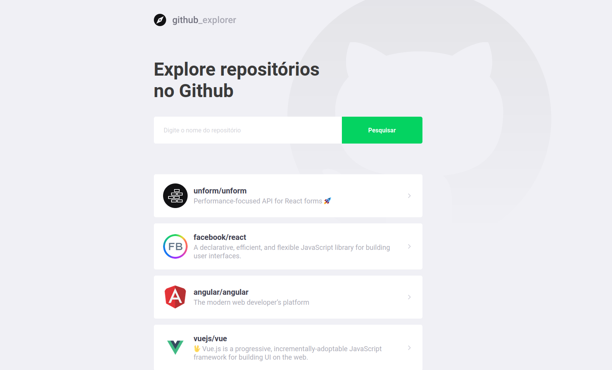

## :scroll: About <a name = "about"></a>

GitHub Explorer is a project to consult Github repositories in a simple, easy, detailed and beautiful way. It was developed during Rocketseat's GoStack 11.



## :rocket: Getting Started <a name = "getting_started"></a>

These instructions will get you a copy of the project up and running on your local machine for development and testing purposes.

#### development mode ( running locally )

```shell
# open your terminal/cmd and clone this repository

git clone https://github.com/luiz-moura/github-explorer-react

# access folder github-explorer-react

cd github-explorer-react

# install dependencies using your favorite package manager

yarn
# or with NPM usign npm install
npm install

# run app typing

yarn start
#or with NPM
npm run start

```

## :information_source: Usage <a name="usage"></a>

It is very simple to use this application:

1. just type inside the input: `owner/repository` that you want to add to your list. Example:

```shell
 facebook/react

 # facebook: owner of repository
 # react: repository name
```

2. Now just click on the repository that you added to see details

## :package: Built Using <a name = "built_using"></a>

- [ReactJS](https://pt-br.reactjs.org/) - UI library
- [TypeScript](https://www.typescriptlang.org/) - Static Type Checking
- [Styled Components](https://styled-components.com/) - CSS in JS library
- [Axios](https://github.com/axios/axios) - Http requests
- [React Router DOM](https://reactrouter.com/web/guides/quick-start) - Navigation
- [React Icons](https://react-icons.github.io/react-icons/) - Svg Icons library

## :star: Credits
@RocketSeat @diego3g
